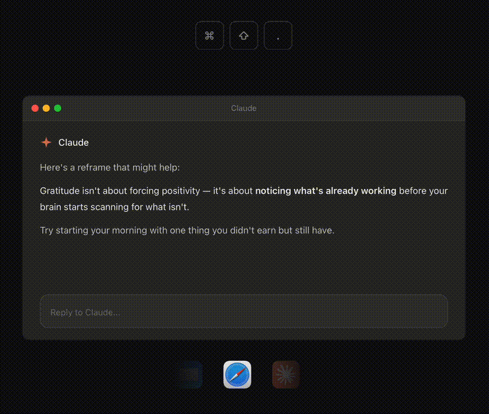
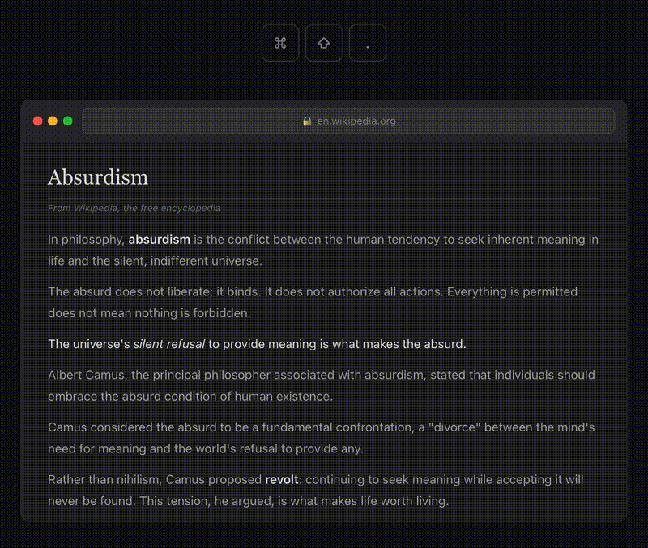
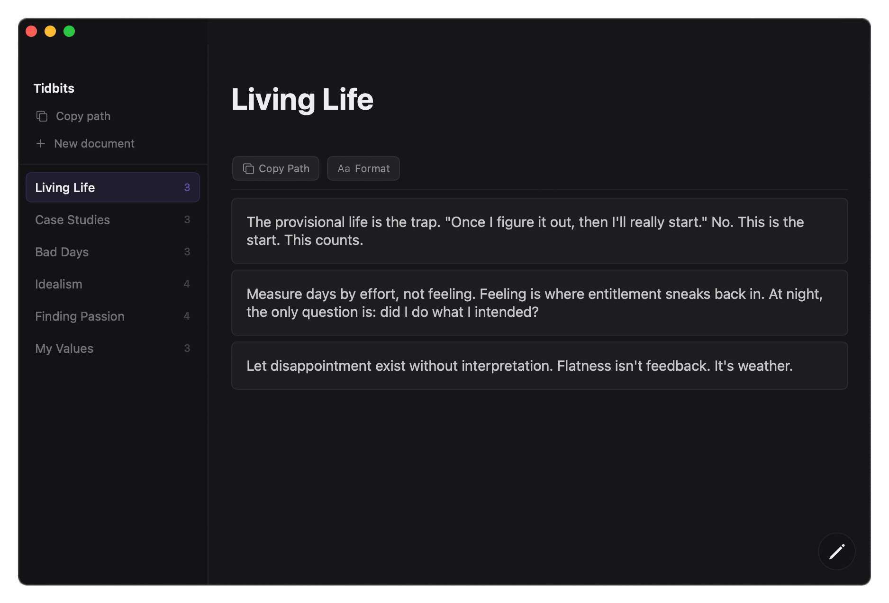

# Tidbits

**Quick capture any text. From anywhere on your Mac.**

Select text in any app, press **⌘⇧.**, and it's saved. No switching windows, no copy-paste workflow, no accounts.



## Capture without switching windows

Tidbits floats on top of whatever you're using. Save, and the panel disappears. Your focus stays where it was.



## Private, offline documents

Everything is stored as local files on your Mac. Zero network calls, zero accounts. Your data is yours — read it, script against it, back it up however you want.



## Designed to just dump text

|  | Obsidian | Tidbits |
|---|---|---|
| Capture from any app | Plugin required | **⌘⇧.** |
| Works without switching windows | No | **Yes** |
| Setup | Vault + plugins + config | **Just ⌘⇧.** |
| Local files | Yes | **Yes** |

Obsidian is a knowledge system. Tidbits is a capture tool. If you just want to grab text fast and organize it later, that's what this is for.

## Works with everything

Browsers, terminals, AI apps, editors, mail, notes — anything with selectable text. Also works via right-click → **Services** → **Add to Tidbits** (no permissions needed).

## Download

[**Download Tidbits**](https://github.com/tidbits-tools/tidbits/releases/latest/download/Tidbits.dmg) — or visit [tidbits.tools](https://tidbits.tools). Requires macOS 14.0+.

## Build from source

Requires Xcode and [xcodegen](https://github.com/yonaskolb/XcodeGen).

```bash
make build-unsigned   # build without signing
make update           # build, install to /Applications, and run
```

See [CLAUDE.md](CLAUDE.md) for architecture, development gotchas, and the full build reference.

## License

[MIT](LICENSE)
